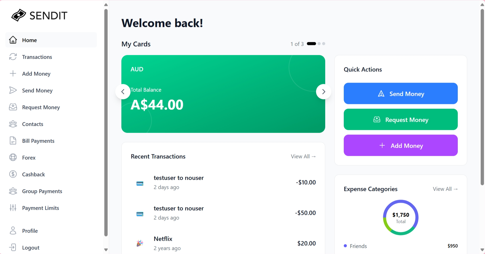
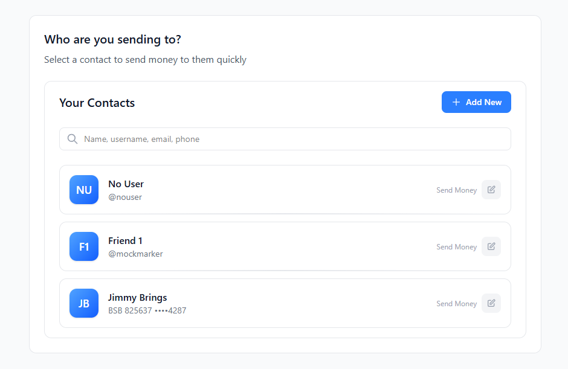
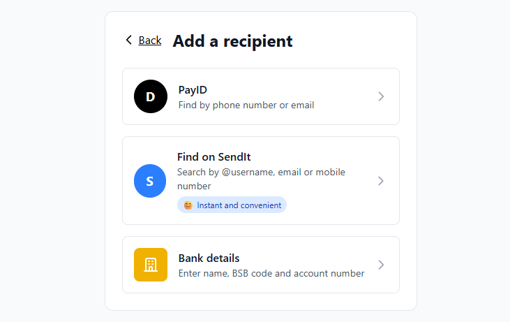
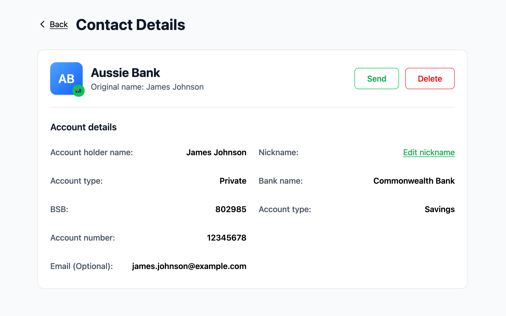

# Real-Time Payments Wallet (PayTo / NPP)

> A full-stack fintech web app that prototypes **real-time Australian bank payments** over the PayTo / NPP rails — KYC onboarding, instant transfers (including PayID), bill payments, group/split payments, multi-currency wallets, and transaction management.

**UNSW COMP3900 — Computer Science Project (Capstone), 25T2.** Project P29: *Design and prototype of a fintech app with PayTo integration via APIs for real-time bank payments in Australia.* Built by a **team of 6** over one term using an agile workflow (GitHub flow + Jira).


> ⚠️ **Educational prototype.** Identity verification runs against an in-repo *mock* ID-check service and there is no connection to real banking infrastructure. Not production software.

## Screenshots

### Dashboard

Live balance, quick actions, recent transactions and an expense-category breakdown.



| Send money | Add a recipient (PayID / username / bank) | Contact details |
|:---:|:---:|:---:|
|  |  |  |

## Features

**Authentication & onboarding**
- Email/password auth via Firebase, protected routes, email verification and password reset
- **KYC verification** — document details + a live webcam selfie, checked against a mock third-party ID-check provider. All money-movement features are gated behind KYC.

**Payments & transfers**
- Send money to other users, to external bank accounts, and via **PayID**
- Saved contacts / payees with editable nicknames
- **Payment requests** — request money from another user and settle pending requests
- **Bill payments** — one-off and **scheduled / recurring** bills (server-side cron) with upcoming-bill reminders

**Group & multi-currency**
- **Group payments / split bills** — shared group wallets, group settings, settle group requests
- **Multi-currency wallets & FX** — currency exchange between wallets

**Money management**
- Dashboard with live balance and breakdown
- **Transaction history** with filtering and manual categorisation
- **Cashback** deals
- Configurable **payment limits**, enforced server-side
- Email notifications for key account events

## Architecture

Four containerised services orchestrated by `docker-compose`, plus Firebase for auth:

```
┌───────────────┐   REST   ┌────────────────────┐   SQL   ┌────────────────────────┐
│   Frontend    │ ───────▶ │    Backend API      │ ──────▶ │     PostgreSQL 17       │
│ React + Vite  │ ◀─────── │  Express + TS       │ ◀────── │  schema + seed + SQL    │
│   :5173       │          │  Swagger  :4000     │         │  functions      :5432   │
└──────┬────────┘          └─────────┬──────────┘         └────────────────────────┘
       │ auth                        │ verify identity
       ▼                             ▼
┌───────────────┐          ┌────────────────────┐
│   Firebase    │          │  Mock ID-Check API  │
│     Auth      │          │  (KYC provider sim) │
└───────────────┘          │  Express   :4001    │
                           └────────────────────┘
```

**Engineering highlights**
- End-to-end **TypeScript** across all three services
- **Zod** request validation with typed DTOs / schemas
- **OpenAPI / Swagger** docs for both the backend and the mock ID-check API
- Security: KYC-gated transactions, server-side payment-limit enforcement, Firebase token-verification middleware
- **PostgreSQL** with versioned init (schema → seed → SQL functions) and database-level tests
- **Cron-scheduled** recurring payments and bills
- Comprehensive **Jest** test suites (frontend, backend, mock API) plus SQL function tests
- One-command, fully **Dockerised** local environment

## Tech stack

| Layer | Technologies |
|---|---|
| **Frontend** | React 19, Vite, TypeScript, Tailwind CSS, React Router, react-webcam |
| **Backend** | Node.js, Express 5, TypeScript, Zod, Swagger (swagger-jsdoc / swagger-ui), Multer, node-cron, Nodemailer |
| **Database** | PostgreSQL 17 (schema, seed data, stored SQL functions) |
| **Auth** | Firebase Auth (client) + Firebase Admin (server token verification) |
| **Mock ID-check** | Express + TypeScript microservice simulating a KYC provider |
| **Tooling** | Docker Compose, Jest, ts-jest, ESLint |

## My contributions

This was a six-person team project. My main areas (by commit history) were:

- **Saved contacts / payees** — add-contact flows, contact methods (incl. PayID), contact details and management
- **Send money & PayID transfers** — user-to-user and to-bank transfer flows
- **Payment requests** — requesting money and settling pending requests
- Contributions to the **PostgreSQL schema** and the **Docker** setup

## Getting started

> Run all Docker commands from the repository root (the folder containing `docker-compose.yml`).

### 1. Clone

```bash
git clone https://github.com/james-gair/realtime-payments-wallet.git
cd realtime-payments-wallet
```

### 2. Create the required env / config files

These are git-ignored and not included. The full variable list is in the project's Final Report → Installation Manual.

- `.env`
- `backend/.env`
- `backend/serviceAccountKey.json` (Firebase Admin service account)
- `frontend/.env`

### 3. Run it (frontend, backend, mock API, database)

```bash
docker-compose up --build
```

| Service | URL |
|---|---|
| Frontend | http://localhost:5173 |
| Backend | http://localhost:4000 |
| Backend API docs (Swagger) | http://localhost:4000/api-docs |
| Mock ID-Check API docs | http://localhost:4001/api-docs |

To "Try it out" on the Mock ID-Check docs, use `mock-kyc-secret-token` in the Swagger **Authorize** dialog (only the sample data in `mock-idcheck-api/src/sampleData.ts` will pass).

Reset the database (clears all data, re-applies schema + seed) and rebuild:

```bash
docker-compose down -v
docker-compose up --build
```

## Testing

Jest powers the frontend, backend and mock-API suites; SQL functions are tested via `psql`.

```bash
# unit/integration tests, inside the running containers
docker exec -it backend_app npm test
docker exec -it frontend_app npm test
docker exec -it mock_idcheck_api npm test

# SQL function tests
docker cp backend/src/database/test_seeds.sql postgres_db:/tmp/test_seeds.sql
docker cp backend/src/database/test.sql        postgres_db:/tmp/test.sql
docker exec -i postgres_db psql -U admin -d mydb -v ON_ERROR_STOP=1 -f /tmp/test.sql
```

## KYC mock data (local testing)

Money-movement features require a **KYC-verified** account. On the KYC page, enter one of the records below *exactly*, upload any `.png`/`.jpeg` for the ID front, and take a webcam photo when prompted:

```
ID Type: passport
Full Name: David Tran
Date of Birth: 03/12/1990
Passport Number: P987654321
Country of Issue: Australia
Expiry Date: 15/03/2029

— or —

ID Type: driver licence
Full Name: Emily Chen
Date of Birth: 15/06/1994
Licence Number: NSW1234567
State of Issue: NSW
Expiry Date: 01/10/2026
```

A pre-verified fallback account (only needed if KYC fails unexpectedly): `testj@gmail.com` / `testj@gmail.com`.

## Acknowledgements

Built as a UNSW COMP3900 capstone by a team of 6 (team "Cherry"), 25T2 2025.
